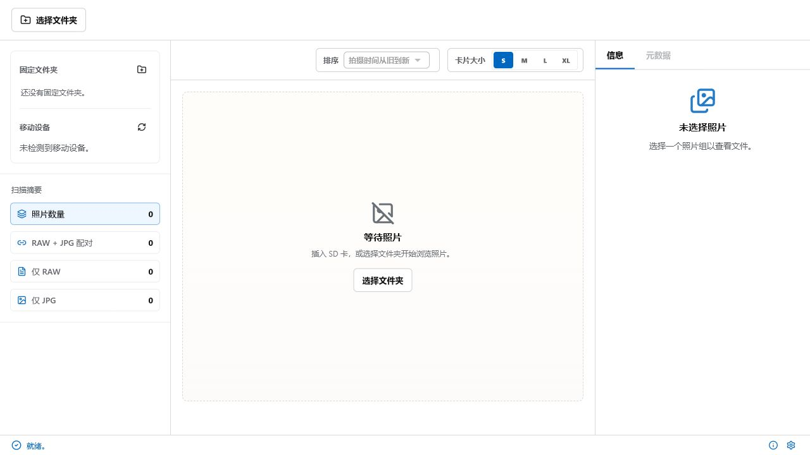

<p align="center">
  
</p>

<h1 align="center">Panasonic Pair Manager</h1>

<p align="center">
  面向 Windows 的 Panasonic 相机媒体管理桌面应用：浏览素材、配对 RAW/JPG、索引视频，并提供更安全的删除流程。
</p>

<p align="center">
  <a href="README.md">English</a>
  ·
  <a href="README.zh-CN.md">简体中文</a>
</p>

<p align="center">
  <a href="https://github.com/magnum-qin/panasonic-pair-manager/actions/workflows/ci.yml"></a>
  <a href="https://github.com/magnum-qin/panasonic-pair-manager/stargazers"></a>
  <a href="https://github.com/magnum-qin/panasonic-pair-manager/releases"></a>
  <a href="LICENSE"></a>
  
  
</p>

## 软件截图



## 功能亮点

- **RAW/JPG 配对**：按文件名主体聚合 Panasonic RAW、JPG、sidecar 与视频文件。
- **文件夹和 SD 卡来源**：扫描固定文件夹和 Panasonic 风格的移动存储目录。
- **快速浏览**：虚拟化图库、卡片大小档位、搜索与排序。
- **预览与元数据**：预览图片/视频，查看文件信息、ExifTool 状态和 FFmpeg 可用性。
- **更安全的删除**：删除前确认同组内的所有目标文件，并移动到回收站。
- **多语言界面**：支持英文、简体中文、繁体中文、日文、韩文、法文、德文、西班牙文和葡萄牙文。

## 安装

如果已经发布预构建安装包，可以从 GitHub Releases 下载：

[下载最新版本](https://github.com/magnum-qin/panasonic-pair-manager/releases)

本地构建请参考下面的开发说明。

## 开发

环境要求：

- Node.js 22 或更高版本
- Rust stable 工具链
- Windows 是主要目标平台

常用命令：

```powershell
npm install
npm run tauri:dev
npm run build
npm run check
npm run tauri:check
```

## 项目结构

```text
src/              React 前端
src/components/   共享 UI 基础组件和可复用组件
src/features/     功能级 UI、hooks 和工作流
src/styles/       设计变量、布局、组件样式和主题
src/locales/      翻译字典
src-tauri/src/    Rust 后端命令、扫描、数据库、删除、缩略图和磁盘集成
```

## 质量检查

提交 Pull Request 前请运行：

```powershell
npm run check
npm run tauri:check
```

## Star 记录

<a href="https://star-history.com/#magnum-qin/panasonic-pair-manager&Date">
  
</a>

## 参与贡献

欢迎贡献。请保持改动聚焦，在 PR 中说明用户可见变化，并在提交前运行质量检查。

完整说明见 [CONTRIBUTING.md](CONTRIBUTING.md)。

## 许可证

本项目基于 [MIT License](LICENSE) 开源。
